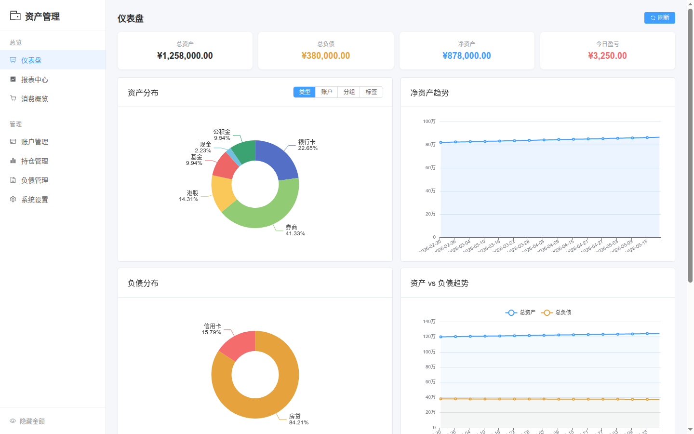
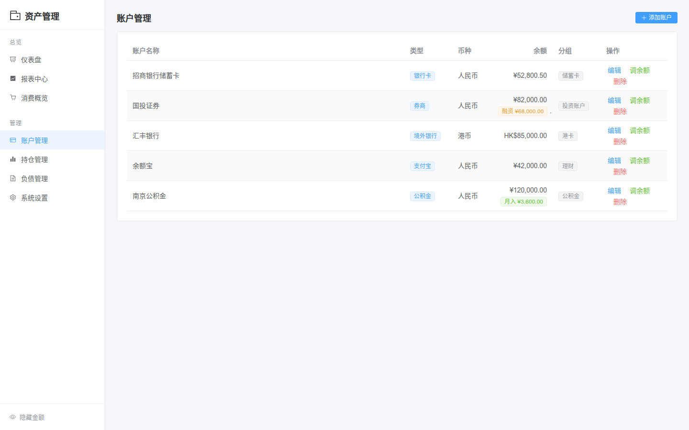
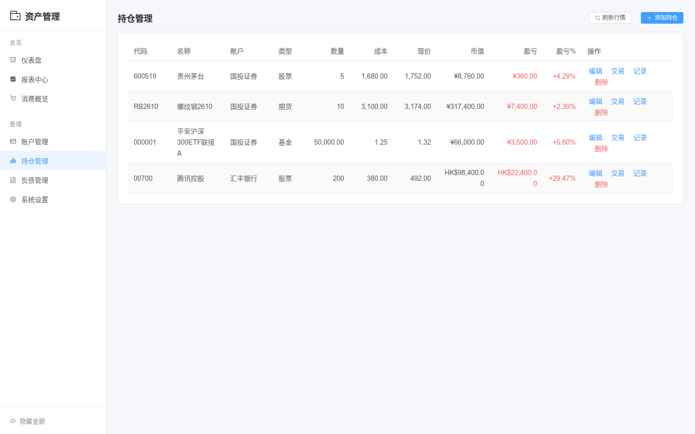
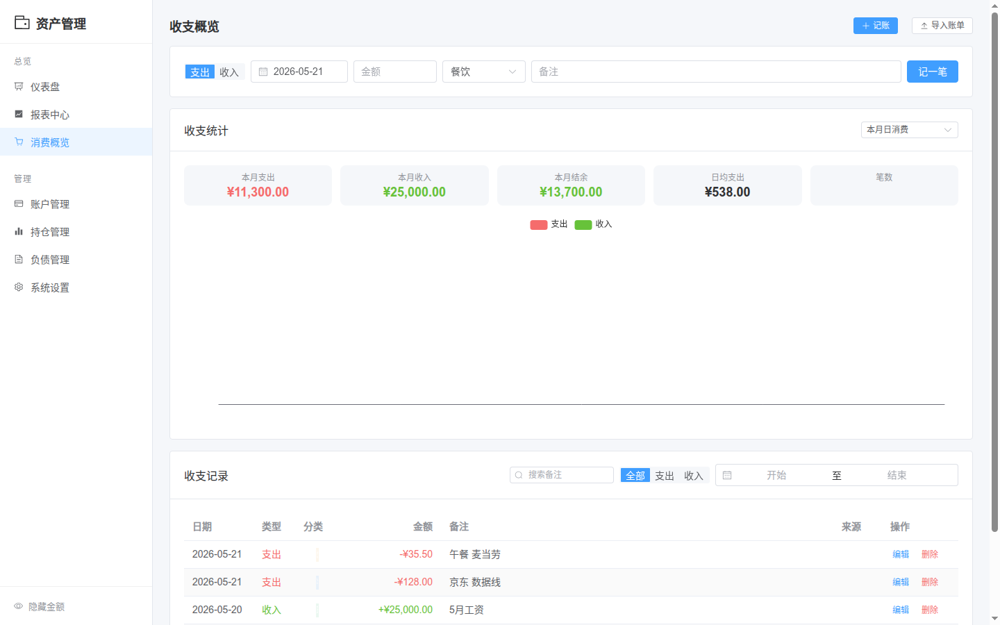
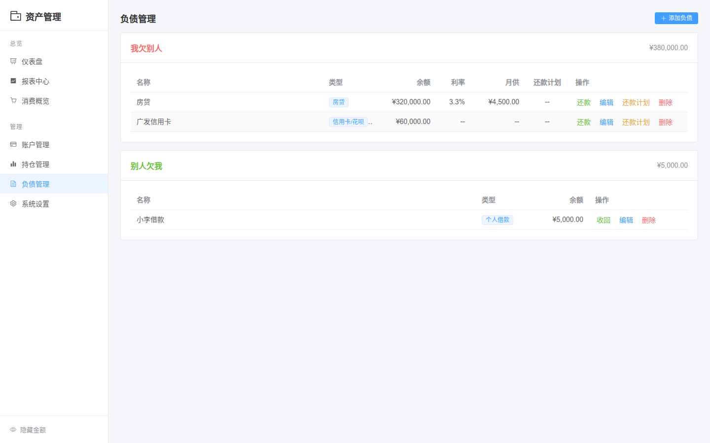
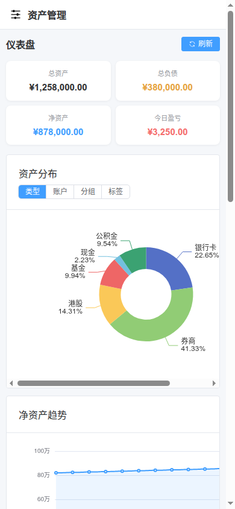

# Wallet — 个人资产管理系统

一套完整的个人资产追踪与记账系统，支持多币种、多资产类型，实时行情自动更新。

## 为什么做这个项目

市面上的记账软件普遍存在几个问题：

- **只支持单一币种** — 大多数 App 只能记人民币，无法管理港币、美元等外币资产
- **缺少投资品种覆盖** — 股票、期货、场内 ETF、场外基金、货币基金、港股、美股……没有一款软件能同时管理这些，更别说自动获取实时行情
- **数据不在自己手里** — 记账数据存在别人的服务器上，导入导出困难，随时可能因服务下线而丢失
- **资产与消费割裂** — 记账软件不管投资，券商 App 不管日常消费，没有一个全局视角看自己的净资产变化

所以我写了 Wallet，用一套系统统一管理所有资产和消费：

- 每个账户可以是不同币种，自动按汇率换算成人民币计算总资产
- 持仓自动从新浪财经、AKShare、Yahoo Finance 等多个数据源获取实时行情
- 每日自动生成快照，追踪净资产变化趋势
- 支持从微信、支付宝、抖音导入消费账单，自动解析分类
- 所有数据存在本地 SQLite 中，完全掌握在自己手里

## 功能概览

### 资产管理

- **多币种账户** — 人民币、港币、美元，自动汇率换算
- **账户分组与标签** — 按储蓄卡、港卡、投资账户、理财等分组，按需打标签
- **融资融券账户** — 支持券商融资账户，区分自有资金和融资负债

### 持仓管理

- **A股** — 沪深股票，新浪财经实时行情
- **港股** — 港交所股票，港币计价自动换算
- **美股** — 纽交所/纳斯达克，Yahoo Finance 备用
- **期货** — 国内期货（上期所/大商所/郑商所/中金所/能源中心），支持具体月份合约和主连；国外期货（COMEX 黄金白银、NYMEX 原油天然气、LME 金属、CBOT 农产品等）
- **场外基金** — 通过 AKShare 获取每日净值
- **货币基金** — 万份收益和七日年化自动更新
- **ETF / 债券** — 同股票行情源

### 仪表盘

- 总资产 / 总负债 / 净资产概览
- 多币种资产分布表
- 资产分布饼图（按类型 / 账户 / 分组 / 标签切换）
- 净资产趋势曲线
- 资产 vs 负债趋势对比
- 月度收支柱状图
- 每日自动快照，记录历史变化

### 消费记录

- 手动记账，支持选日期
- 收入 / 支出双方向
- 分类标签自动着色
- 关键词搜索
- 编辑已有记录

### 账单导入

- **微信支付** — 上传 xlsx 账单，自动解析
- **支付宝** — 上传 csv 账单
- **抖音** — 上传 pdf 账单
- 自动识别退款并销账（全额退款删除原记录，部分退款调整金额）
- 支付方式自动匹配到系统账户（支持信用卡/负债匹配）
- 交易单号去重，防止重复导入
- 智能分类：根据商品名称、交易对方自动归类

### 负债管理

- **我欠别人** — 房贷、信用卡、个人贷款等，支持设置还款计划
- **别人欠我** — 记录借出款项，支持"收回"操作
- 还款计划 — 等额本息 / 等额本金推算，手动执行扣款
- 手动还款 — 输入本金和利息，自动扣减账户余额

### 其他

- 汇率管理 — 一键刷新最新汇率
- 数据备份 — 下载 SQLite 数据库文件，上传恢复
- 响应式设计 — 桌面端和移动端自适应

## 技术栈

| 层级 | 技术 |
|---|---|
| 前端 | Vue 3 + TypeScript + Element Plus + ECharts |
| 后端 | FastAPI + SQLAlchemy 2.0 (async) |
| 数据库 | SQLite (默认) / PostgreSQL (Docker) |
| 行情数据 | 新浪财经、AKShare (东方财富)、Yahoo Finance |
| 部署 | Docker Compose / 本地直接运行 |

## 项目结构

```
wallet/
├── frontend/                # Vue 3 前端
│   ├── src/
│   │   ├── views/          # 页面组件
│   │   ├── api/            # Axios 请求封装
│   │   ├── types/          # TypeScript 类型定义
│   │   └── utils/          # 工具函数
│   └── package.json
├── backend/                 # FastAPI 后端
│   ├── app/
│   │   ├── api/            # API 路由
│   │   ├── models/         # SQLAlchemy 模型
│   │   ├── schemas/        # Pydantic 数据校验
│   │   └── services/       # 业务逻辑（行情获取、账单解析、快照计算）
│   ├── requirements.txt
│   └── wallet.db           # SQLite 数据库 (运行后生成)
├── docker-compose.yml
└── .env.example
```

## 快速开始

### 环境要求

- Python 3.11+
- Node.js 18+
- npm 或 pnpm

### 后端

```bash
cd backend

# 创建虚拟环境
python -m venv venv
source venv/bin/activate  # Windows: venv\Scripts\activate

# 安装依赖
pip install -r requirements.txt

# 配置环境变量
cp ../.env.example .env
# 编辑 .env，默认使用 SQLite 无需修改

# 启动
uvicorn app.main:app --reload --host 0.0.0.0 --port 8000
```

首次启动会自动创建数据库表并生成当日快照。

### 前端

```bash
cd frontend

# 安装依赖
npm install

# 开发模式
npm run dev

# 生产构建
npm run build
```

开发模式默认访问 `http://localhost:5173`，API 请求会代理到后端 `localhost:8000`。

### Docker Compose (使用 PostgreSQL)

```bash
# 编辑 .env 设置数据库连接
cp .env.example .env

docker compose up -d
```

启动后访问 `http://localhost:3000`。

## 配置说明

在 `.env` 文件中配置：

| 变量 | 默认值 | 说明 |
|---|---|---|
| `DATABASE_URL` | `sqlite+aiosqlite:///./wallet.db` | 数据库连接 |
| `CORS_ORIGINS` | `["http://localhost:5173"]` | 允许的前端跨域地址 |
| `MARKET_REFRESH_INTERVAL_MINUTES` | `30` | 行情刷新间隔（分钟） |
| `EXCHANGE_RATE_API_KEY` | 空 | 汇率 API Key（可选，默认使用免费接口） |

## 期货合约代码说明

持仓中添加期货时，代码 (symbol) 的填写规则：

**国内期货** — 品种代码 + 合约月份：
- `RB2610` — 螺纹钢 2026年10月合约
- `AU2606` — 黄金 2026年6月合约
- `I2609` — 铁矿石 2026年9月合约
- `IF2606` — 沪深300股指 2026年6月合约
- `RB0` — 螺纹钢连续（主连）

常见品种代码：RB(螺纹钢)、AU(黄金)、AG(白银)、CU(铜)、I(铁矿石)、M(豆粕)、IF(沪深300)、IC(中证500) 等。

**国外期货** — 固定品种代码：
- `GC` — COMEX 黄金、`SI` — COMEX 白银、`HG` — COMEX 铜
- `CL` — NYMEX 原油、`NG` — NYMEX 天然气
- `XAU` — 伦敦金、`XAG` — 伦敦银、`OIL` — 布伦特原油
- `S` — CBOT 黄豆、`W` — CBOT 小麦、`C` — CBOT 玉米

## 截图

### 仪表盘


### 账户管理


### 持仓管理


### 收支记录


### 负债管理


### 移动端适配


> 截图使用演示数据，内置"隐藏金额"功能，一键将所有金额替换为 `***`，方便截图分享。

## License

[AGPL 3.0](LICENSE)
